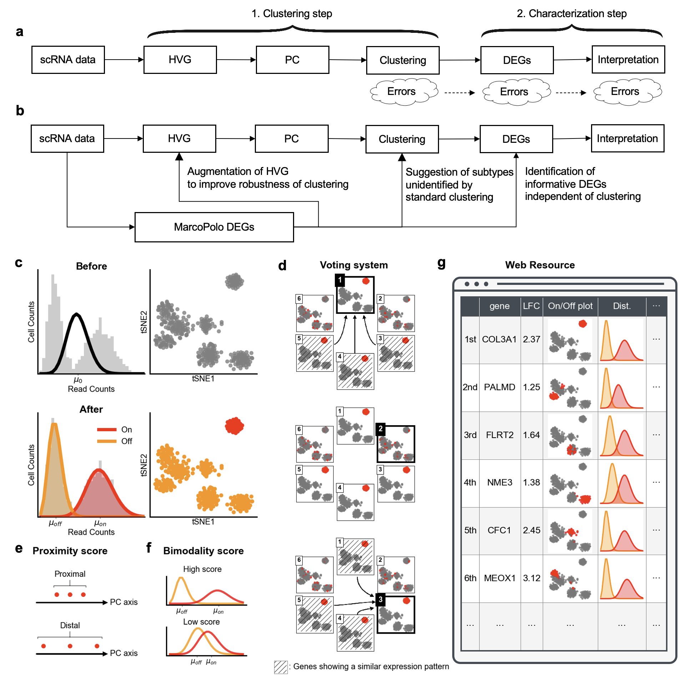

MarcoPolo is a method to discover differentially expressed genes in single-cell RNA-seq data without depending on prior clustering


## Overview





`MarcoPolo` is a novel clustering-independent approach to identifying DEGs in scRNA-seq data. MarcoPolo identifies informative DEGs without depending on prior clustering, and therefore is robust to uncertainties from clustering or cell type assignment. Since DEGs are identified independent of clustering, one can utilize them to detect subtypes of a cell population that are not detected by the standard clustering, or one can utilize them to augment HVG methods to improve clustering. An advantage of our method is that it automatically learns which cells are expressed and which are not by fitting the bimodal distribution. Additionally, our framework provides analysis results in the form of an HTML file so that researchers can conveniently visualize and interpret the results.

|Datasets|URL|
|:---|:---|
|Human liver cells (MacParland et al.)|[https://chanwkimlab.github.io/MarcoPolo/HumanLiver/](https://chanwkimlab.github.io/MarcoPolo/HumanLiver/)|
|Human embryonic stem cells (The Koh et al.)|[https://chanwkimlab.github.io/MarcoPolo/hESC/](https://chanwkimlab.github.io/MarcoPolo/hESC/)|
|Peripheral blood mononuclear cells (Zheng et al.)|[https://chanwkimlab.github.io/MarcoPolo/Zhengmix8eq/](https://chanwkimlab.github.io/MarcoPolo/Zhengmix8eq/)|

## Installation

Currently, `MarcoPolo` was tested only on Linux machines.
Dependencies are as follows:
* `python` (3.7)
    * `numpy` (1.19.5)
    * `pandas` (1.2.1)
    * `scipy` (1.6.0)
    * `scikit-learn` (0.24.1)
    * `pytorch` (1.4.0)
    * `rpy2` (3.4.2)
    * `jinja2` (2.11.2)
* `R` (4.0.3)
    * `Seurat` (3.2.1)
    * `scran` (1.18.3)
    * `Matrix` (1.3.2)
    * `SingleCellExperiment` (1.12.0)

Download MarcoPolo by `git clone`
```
git clone https://github.com/chanwkimlab/MarcoPolo.git
```

We recommend using the following pipeline to install the dependencies.

1. Install Anaconda
Please refer to https://docs.anaconda.com/anaconda/install/linux/
make conda environment and activate it
```
conda create -n MarcoPolo python=3.7
conda activate MarcoPolo
```

2. Install Python packages
```
pip install numpy=1.19.5 pandas=1.21 scipy=1.6.0 scikit-learn=0.24.1 jinja2==2.11.2 rpy2=3.4.2
```
Also, please install `PyTorch` from https://pytorch.org/ (If you want to install CUDA-supported PyTorch, please install CUDA in advance)

3. Install R and required packages
```
conda install -c conda-forge r-base=4.0.3
```
In R, run the following commands to install packages.
```
install.packages("devtools")
devtools::install_version(package = 'Seurat', version = package_version('3.2.1'))
install.packages("Matrix")
install.packages("BiocManager")
BiocManager::install("scran")
BiocManager::install("SingleCellExperiment")
```

# Getting started

1. Converting scRNA-seq dataset you have to python-compatible file format.

If you have a Seurat object `seurat_object`, you can save it to a Python-readable file format using the following R
codes. An example output by the function is in the `example` directory with the prefix `sample_data`. The data has 1,000
cells and 1,500 genes in it.


```
save_sce <- function(sce,path,lowdim='TSNE'){
    
    sizeFactors(sce) <- calculateSumFactors(sce)
    
    save_data <- Matrix(as.matrix(assay(sce,'counts')),sparse=TRUE)
    
    writeMM(save_data,sprintf("%s.data.counts.mm",path))
    write.table(as.matrix(rownames(save_data)),sprintf('%s.data.row',path),row.names=FALSE, col.names=FALSE)
    write.table(as.matrix(colnames(save_data)),sprintf('%s.data.col',path),row.names=FALSE, col.names=FALSE)
    
    tsne_data <- reducedDim(sce, lowdim)
    colnames(tsne_data) <- c(sprintf('%s_1',lowdim),sprintf('%s_2',lowdim))
    print(head(cbind(as.matrix(colData(sce)),tsne_data)))
    write.table(cbind(as.matrix(colData(sce)),tsne_data),sprintf('%s.metadatacol.tsv',path),row.names=TRUE, col.names=TRUE,sep='\t')    
    write.table(cbind(as.matrix(rowData(sce))),sprintf('%s.metadatarow.tsv',path),row.names=TRUE, col.names=TRUE,sep='\t')    
    
    write.table(sizeFactors(sce),file=sprintf('%s.size_factor.tsv',path),sep='\t',row.names=FALSE, col.names=FALSE)    

}

sce_object <- as.SingleCellExperiment(seurat_object)
save_sce(sce_object, 'example/sample_data')
```

2. Running MarcoPolo

Please use the same path argument you used for running the `save_sce` function above. You can incorporate covariate -
denoted as ß in the paper - in modeling the read counts by setting the `Covar` parameter.

```
import MarcoPolo.QQscore as QQ
import MarcoPolo.summarizer as summarizer

path='scRNAdata'
QQ.save_QQscore(path=path,device='cuda:0')
allscore=summarizer.save_MarcoPolo(input_path=path,
                                   output_path=path)
```

3. Generating MarcoPolo HTML report
```
import MarcoPolo.report as report
report.generate_report(input_path="scRNAdata",output_path="report/hESC",top_num_table=1000,top_num_figure=1000)
```

- Note
  - User can specify the number of genes to include in the report file by setting the `top_num_table`
    and `top_num_figure` parameters.
  - If there are any two genes with the same MarcoPolo score, a gene with a larger fold change value is prioritized.

The function outputs the two files:

- report/hESC/index.html (MarcoPolo HTML report)
- report/hESC/voting.html (For each gene, this file shows the top 10 genes of which on/off information is similar to the
  gene.)

## To-dos

- [ ] supporting `AnnData` object, which is used by `scanpy` by default.
- [ ] building colab running environment

## Citation

If you use any part of this code or our data, please cite our
[paper](https://doi.org/10.1093/nar/gkac216).

```
@article{kim2022marcopolo,
  title={MarcoPolo: a method to discover differentially expressed genes in single-cell RNA-seq data without depending on prior clustering},
  author={Kim, Chanwoo and Lee, Hanbin and Jeong, Juhee and Jung, Keehoon and Han, Buhm},
  journal={Nucleic Acids Research},
  year={2022}
}
```

## Contact
If you have any inquiries, please feel free to contact
- [Chanwoo Kim](https://chanwoo.kim) (Paul G. Allen School of Computer Science & Engineering @ the University of
  Washington)